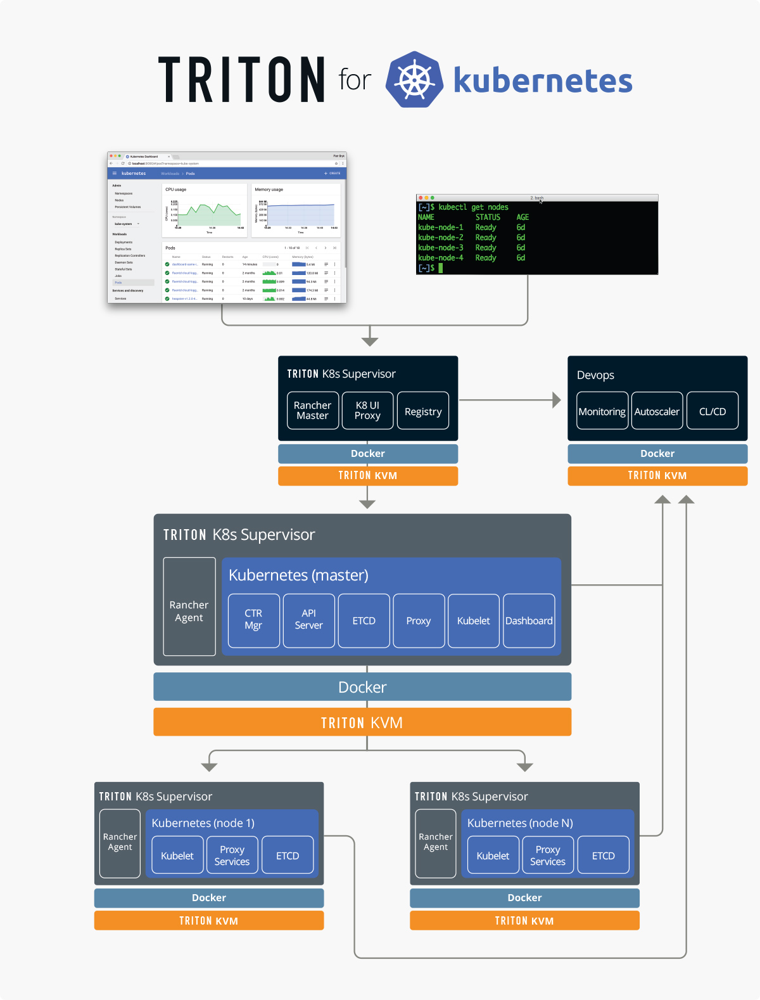

# k8sontriton

## Quick Start Guide
In this guide, we will start a simple 2 worker node Kubernetes install that runs on Joyent Cloud.

### Pre-Reqs
The following pre-reqs are to be set up on the machine performing the Kubernetes set up.
1. [Install and set up triton CLI and a profile](https://docs.joyent.com/public-cloud/api-access/cloudapi)  
   Install [nodejs](https://nodejs.org/en/download/) and run `npm install -g triton`.

   Triton CLI needs to be configured with a profile because we will be using it and its configuration information to set up our Kubernetes cluster.

   To setup triton CLI, you need to [create an account](https://sso.joyent.com/signup) with Joyent, [add your billing information](https://my.joyent.com/main/#!/account/payment) and [ssh key](https://my.joyent.com/main/#!/account) to your account.  
   For more information on how to create an account, billing and ssh key information, look at the [Getting started](https://docs.joyent.com/public-cloud/getting-started) page.

   Note: The data center that will be used must have KVM images available for provisioning.
1. [Install terraform](https://www.terraform.io/intro/getting-started/install.html)  
   Terraform is an infrastructure building, changing and versioning tool. It will be used to provision KVMs for the Kubernetes cluster.

   Terraform can be installed by getting the appropriate [package](https://releases.hashicorp.com/terraform/0.8.5/terraform_0.8.5_darwin_amd64.zip) for your system which includes a single binary program terraform. Place this binary in a directory that is on the `PATH`.

   Note: Supported version of terraform is needed ([4.15](https://releases.hashicorp.com/terraform/0.8.5/terraform_0.8.5_darwin_amd64.zip))
1. Install Ansible  
   [Ansible](http://docs.ansible.com/ansible/index.html) is and IT automation tool we are using to set up the Kubernetes cluster on JoyentCloud KVMs.

   There are [multiple ways to install ansible](http://docs.ansible.com/ansible/intro_installation.html) depending on your operating system. Simplest way to do this is by using `pip` command (python package manager).  
   `sudo pip install ansible`
1. Python v2.x  
   OSX comes with python 2.7, but if you are on windows or linux, make sure you have [python](https://www.python.org/downloads/) installed on your system.

### Starting Kubernetes Cluster
Download the k8sontriton package and run `setup.sh`.

Follow the on screen instructions answering questions about the cluster. You can use the default by pressing “Enter”/”Return” key.

#### CLI Questions
The following questions will require answers that can include spaces:
```
Name your Kubernetes environment: (k8s dev)
Describe this Kubernetes environment: (k8s dev)
```
Hostnames must start with letters and can only include letters and numbers:
```
Hostname of the master: (kubemaster)
Enter a string to use for appending to hostnames of all the nodes: (kubenode)

How many nodes should this Kubernetes cluster have: (2)
```
For the following three questions, either press “Enter”/”Return” to use the default:  
```  
What networks should the master be a part of, provide comma separated values: (31428241-4878-47d6-9fba-9a8436b596a4)
What networks should the nodes be a part of, provide comma separated values: (31428241-4878-47d6-9fba-9a8436b596a4)
What KVM package should the master and nodes run on: (14b6fade-d0f8-11e5-85c5-4ff7918ab5c1)
```

This will provide a Kubernetes environment on triton that will be set up as below:


<sub>For a more detailed guide and how the automation works, click [here](docs/detailed.md).</sub>
