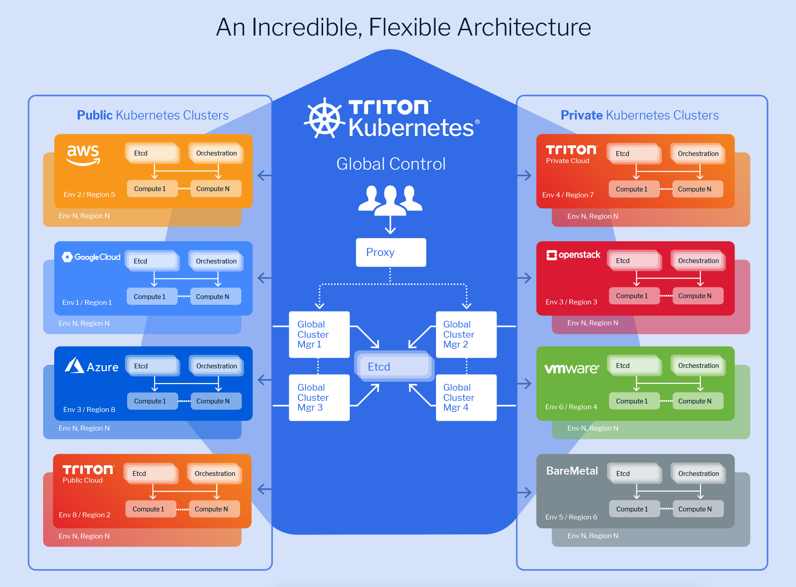

<a>
  
</a>

Triton Kubernetes is a multi-cloud Kubernetes solution. It has a global cluster manager (control plane) which can run on any cloud - Public, Private or Bare Metal and manages Kubernetes environments. The current release uses Triton (Joyent public cloud). With our forthcoming release, you will be able to run the global control plane on any cloud, bare metal or VMware.

The cluster manager will manage environments running on any region of any supported cloud. Out of box, AWS, Azure, Google and Triton (public and private) are supported. If not using a cloud, environments on bare metal servers are also going to be supported in our forthcoming release. For an example set up, look at the [Working with the CLI](#Working-with-the-CLI) section.



`triton-kubernetes` interactive cli is one of two ways you can interact with Triton Multi-Cloud Kubernetes. Using `triton-kubernetes` cli, you can:

- create a cluster manager
- destroy a cluster manager and all clusters it is managing
- add/remove a cluster to/from an existing cluster manager
- backup/restore a kubernetes namespace from any of your clusters to manta/S3
- query your existing cluster managers and clusters

The cli `triton-kubernetes` allows for creating and managing a kubernetes deployment only. Application deployments will still need to be done using `kubectl`.

> <sub>Note: Keep in mind that every cloud has a resource quota. If that quota has been reached, Triton-Kubernetes will not be able to provision new machines and throw errors.</sub>

## Quick Start Guide

### Pre-Requisites
In order to run **Triton Kubernetes**, you must create a [Triton](https://my.joyent.com/) account and install [`jq`](#install-jq) and [`terraform`](#install-terraform).

[Triton](https://www.joyent.com/why) is our container-native and open source cloud, which we will use to provide the infrastructure required for your Kubernetes cluster.

[jq](https://stedolan.github.io/jq/) is a lightweight and flexible command-line JSON processor. It is leveraged by `triton-kubernetes`.

[Terraform](https://www.terraform.io/) enables you to safely and predictably create, change, and improve production infrastructure. It is an open source tool that codifies APIs into declarative configuration files that can be shared amongst team members, treated as code, edited, reviewed, and versioned.

#### Install `jq`

Install `jq` for the system you are on:

```bash
# OS X using brew
brew install jq

# Debian/Ubuntu
apt-get install jq

# CentOS/RHEL
yum install jq
```

#### Install Terraform

Install `terraform` for the system you are on:
```bash
# OS X using brew
brew install terraform

# Debian/Ubuntu/CentOS/RHEL
wget https://releases.hashicorp.com/terraform/0.11.2/terraform_0.11.2_linux_amd64.zip
unzip terraform_0.11.2_linux_amd64.zip
mv terraform /usr/local/bin/
```

#### Install `triton-kubernetes`
Download Binary:
TODO

From Source:
```bash
go get -u github.com/joyent/triton-kubernetes
go install github.com/joyent/triton-kubernetes
triton-kubernetes --help
```

#### Build `triton-kubernetes` CLI

 * [Build and Install](https://github.com/joyent/triton-kubernetes/tree/master/docs/guide/building-cli.md)

## Working with the CLI

Triton Kubernetes allows you to create/destroy global cluster managers, kubernetes environments and individual cluster nodes. You can also get information on a cluster manager or kubernetes environment. Triton Kubernetes provides these features through the `create`, `destroy` and `get` commands.


To get help on a command, use the --help flag. For example:

```
$ triton-kubernetes --help
This is a multi-cloud Kubernetes solution. Triton Kubernetes has a global
cluster manager which will run on Triton and manages Kubernetes environments. This
cluster manager will manage environments running on any region of any supported cloud.
For an example set up, look at the How-To section.

Usage:
  triton-kubernetes [command]

Available Commands:
  create      Create cluster managers, kubernetes clusters or individual kubernetes cluster nodes.
  destroy     Destroy cluster managers, kubernetes clusters or individual kubernetes cluster nodes.
  get         Display resource information
  help        Help about any command
  version     Print the version number of triton-kubernetes

Flags:
      --config string     config file (default is $HOME/.triton-kubernetes.yaml)
  -h, --help              help for triton-kubernetes
      --non-interactive   Prevent interactive prompts
  -t, --toggle            Help message for toggle

Use "triton-kubernetes [command] --help" for more information about a command.
```

### Create

```bash
triton-kubernetes create [manager or cluster or node]
```

Creates a new cluster manager, kubernetes cluster or individual kubernetes cluster node.

When creating a new kubernetes cluster, you must specify the cloud provider for that cluster (Triton, AWS, Azure GCP).

### Destroy

```bash
triton-kubernetes destroy [manager or cluster or node]
```

Destroys an existing cluster manager, kubernetes cluster or individual kubernetes cluster node.

### Get

```bash
triton-kubernetes get [manager or cluster]
```

Displays cluster manager or kubernetes cluster details.

## Backend State

Triton Kubernetes persists state by leveraging one of the supported backends. This state is required to add/remove/modify infrastructure managed by Triton Kubernetes.

### Manta
Will persist state in the `/triton-kubernetes/` folder for the provided user in Manta Cloud Storage.

### Local
Will persist state in the `~/.triton-kubernetes/` folder on the machine Triton Kubernetes was run on.

### Examples
 * [Manager](https://github.com/joyent/triton-kubernetes/tree/master/docs/guide/cluster-manager.md)
 * [Cluster](https://github.com/joyent/triton-kubernetes/tree/master/docs/guide/cluster.md)

## How-To cut the release

* [Release Process](https://github.com/joyent/triton-kubernetes/tree/master/docs/guide/release-process.md)

## Developing Locally

### Testing terraform module changes
The `SOURCE_URL` flag will override the default terraform module source. Default is `github.com/joyent/triton-kubernetes`.

The `SOURCE_REF` flag will override the default branch/tag/commit reference for the terraform module source. Default is `master`

Testing local changes
```bash
SOURCE_URL=/full/path/to/working/dir/triton-kubernetes ./triton-kubernetes
```

Testing remote changes
```bash
SOURCE_URL=github.com/fayazg/triton-kubernets SOURCE_REF=new-branch ./triton-kubernetes
```
