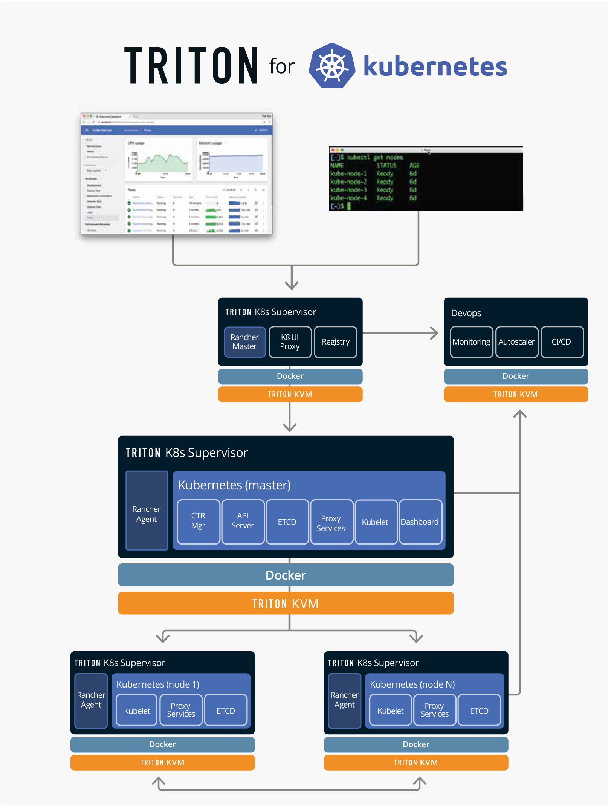
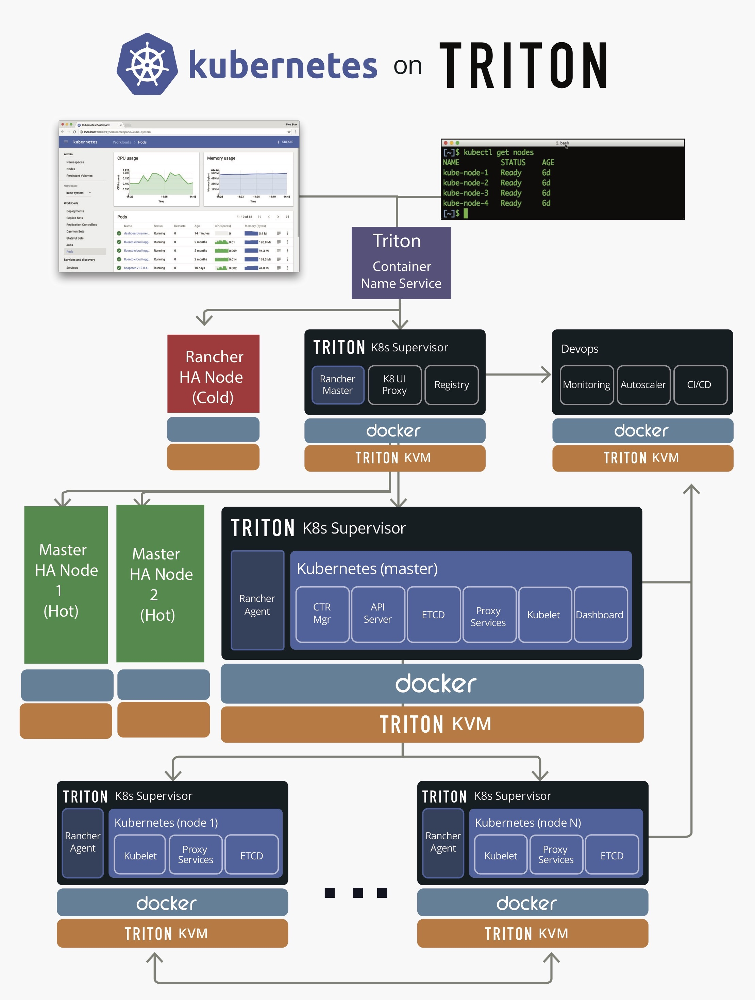

## Quick Start Guide
In this guide, we will start a simple 2 worker node Kubernetes install that runs on Joyent Cloud.

### Pre-Reqs
In order to start running Triton K8s Supervisor, you must create a **Triton** account and install the **Triton CLI**, **Terraform**, **Ansible**, and the **Kubernetes CLI**.

[Triton](https://www.joyent.com/why) is our container-native and open source cloud, which we will use to provide the infrastructure required for your Kubernetes cluster. 

[Terraform](https://www.terraform.io/) enables you to safely and predictably create, change, and improve production infrastructure. It is an open source tool that codifies APIs into declarative configuration files that can be shared amongst team members, treated as code, edited, reviewed, and versioned. We use Terraform to provision virtual machines, set up root access, and install `python`.

[Ansible](http://docs.ansible.com/ansible/intro_installation.html) is an IT automation tool that enables app deployment, configuration management and orchestration. We are using Ansible to install pre-reqs (including supported version of docker-engine), create Kubernetes environment and set up Kubernetes cluster.

#### Install Triton

In order to install Triton, first you must have a [Triton account](https://sso.joyent.com/signup). As a new user you will recieve a $250 credit to enable you to give Triton and Kubernetes a test run, but it's important to [add your billing information](https://my.joyent.com/main/#!/account/payment) and [add an ssh key](https://my.joyent.com/main/#!/account) to your account. If you need instructions for how to generate and SSH key, [read our documentation](https://docs.joyent.com/public-cloud/getting-started).

1.  Install [Node.js](https://nodejs.org/en/download/) and run `npm install -g triton` to install Triton CLI.
1.  `triton` uses profiles to store access information. You'll need to set up profiles for relevant data centers.
    +   `triton profile create` will give a [step-by-step walkthrough](https://docs.joyent.com/public-cloud/api-access/cloudapi) of how to create a profile.
	+   Choose a profile to use for your Kubernetes Cluster.
1.  Get into the Triton environment with `eval $(triton env <profile name>)`.
1.  Run `triton info` to test your configuration.

#### Terraform

Terraform will be downloaded automatically under the `<k8s-triton-supervisor>/bin/` directory.

#### Install Ansible

There are [many ways to install Ansible](http://docs.ansible.com/ansible/intro_installation.html), but the simplest would be to use Python package manager (`pip`). If you don’t already have `pip` installed, install it:

```
sudo easy_install pip
```
Ansible by default manages machines over SSH and requires Python 2.6 or 2.7 to be installed on all the hosts.

Install Ansible:

```
sudo pip install ansible
```

Once done, you can run `ansible` to test your installation. You should see a list of usage commands that looks like the following:

```
$ ansible
Usage: ansible <host-pattern> [options]

Options:
  -a MODULE_ARGS, --args=MODULE_ARGS
                        module arguments
  --ask-vault-pass      ask for vault password
  -B SECONDS, --background=SECONDS
                        run asynchronously, failing after X seconds
                        (default=N/A)
  -C, --check           don't make any changes; instead, try to predict some
                        of the changes that may occur
  -D, --diff            when changing (small) files and templates, show the
                        differences in those files; works great with --check
[...]
```

#### Install the Kubernetes CLI

There are different ways to [install `kubectl`](https://kubernetes.io/docs/tasks/kubectl/install/), but the simplest way is via `curl`:

```sh
# OS X
curl -LO https://storage.googleapis.com/kubernetes-release/release/$(curl -s https://storage.googleapis.com/kubernetes-release/release/stable.txt)/bin/darwin/amd64/kubectl

# Linux
curl -LO https://storage.googleapis.com/kubernetes-release/release/$(curl -s https://storage.googleapis.com/kubernetes-release/release/stable.txt)/bin/linux/amd64/kubectl

# Windows
curl -LO https://storage.googleapis.com/kubernetes-release/release/$(curl -s https://storage.googleapis.com/kubernetes-release/release/stable.txt)/bin/windows/amd64/kubectl.exe
```

### Starting Kubernetes Cluster
Download the k8sontriton package and run `setup.sh`:

```bash
$ git clone https://github.com/joyent/k8s-triton-supervisor.git
Cloning into 'k8s-triton-supervisor'...
$ cd k8s-triton-supervisor 
$ ./setup.sh
```

Follow the on screen instructions answering questions about the cluster. You can use the default by pressing “Enter”/”Return” key.

#### Setup Questions

```
Name your Kubernetes environment: (k8s dev)
Describe this Kubernetes environment: (k8s dev)
Would you like HA for Kubernetes Cluster Manager (+3 VMs) (yes | no)?
Run Kubernetes Management Services on dedicated nodes (+3 VMs for etcd, +3 VMs for K8s services - apiserver/scheduler/controllermanager...) (yes | no)?
Hostname of the master: (kubemaster)
Enter a string to use for appending to hostnames of all the nodes: (kubenode)
How many nodes should this Kubernetes cluster have: (1) 2
What networks should the master be a part of, provide comma separated values: (31428241-4878-47d6-9fba-9a8436b596a4)
What networks should the nodes be a part of, provide comma separated values: (31428241-4878-47d6-9fba-9a8436b596a4)
What KVM package should the master and nodes run on: (14b6fade-d0f8-11e5-85c5-4ff7918ab5c1)
```

After verification of the entries, setup will provide a Kubernetes environment on triton that will be set up as below:

| without HA  | with HA  |
|----|----|
|  |  |

For a more detailed guide and how the automation works, click [here](docs/detailed.md).
