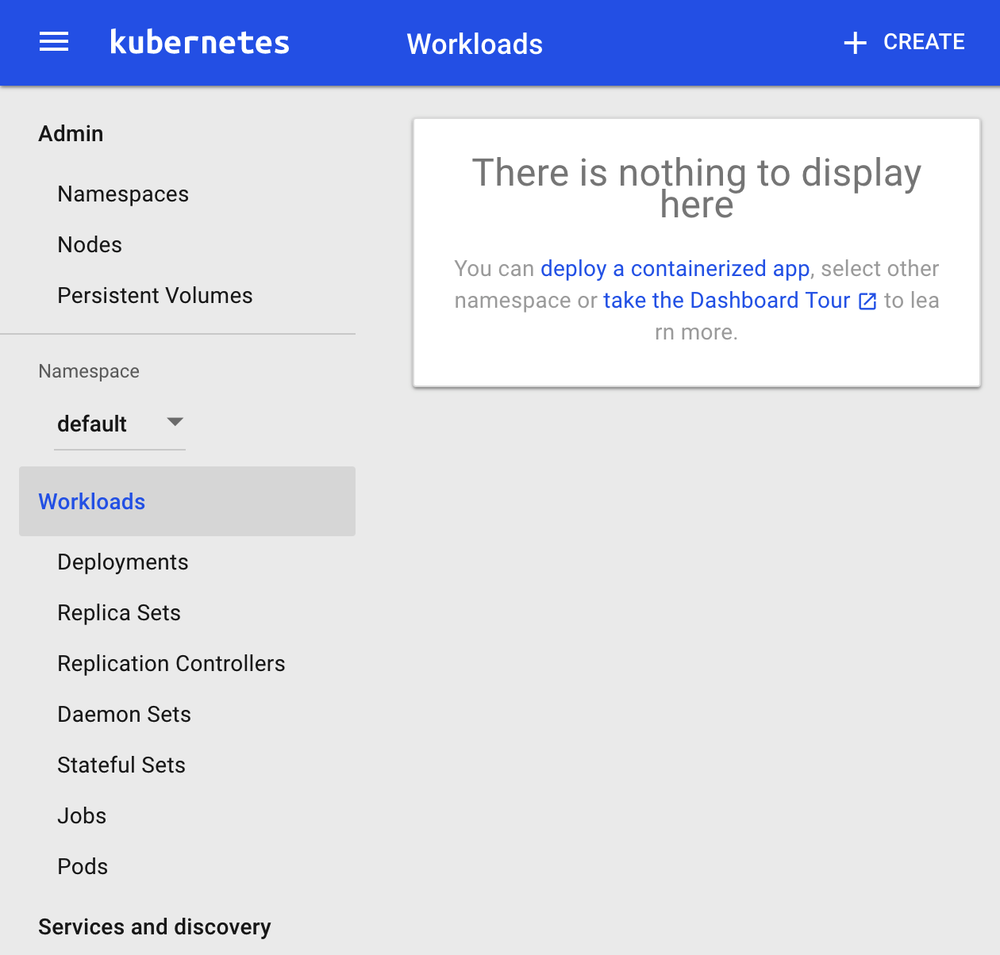
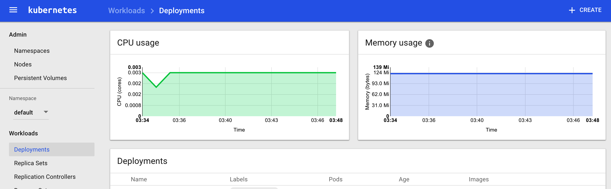
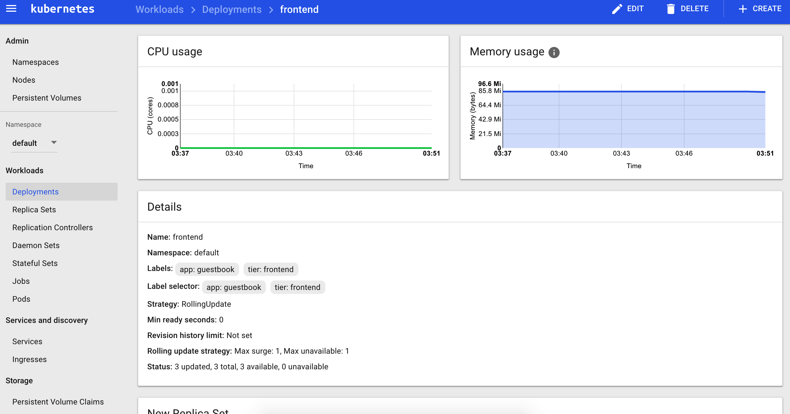

# TABLE OF CONTENT
*   [Architecture](#architecture)
*   [Pre-Reqs](#pre-reqs)
*   [Create a Kubernetes cluster](#create-a-kubernetes-cluster)
*   [Deploying on Kubernetes](#deploying-on-kubernetes)
    *   [Deploy using Kubernetes Dashboard (Web UI)](#deploy-using-kubernetes-dashboard-web-ui)
    *   [Deploy using Kubernetes CLI](#deploy-using-kubernetes-cli)
*   [References](#references)
    *   [Triton CLI](#triton-cli)
        *   [Install Triton CLI](#install-triton-cli)
        *   [Create Profile](#create-profile)
    *   [Terraform](#terraform)
        *   [Install Terraform](#install-terraform)
    *   [Ansible Config Generation](#ansible-config-generation)
    *   [Ansible](#ansible)
        *   [Install Ansible](#install-ansible)
    *   [Kubernetes Dashboard](#kubernetes-dashboard)
    *   [Kubernetes CLI](#kubernetes-cli)
    *   [Autoscaling in Kubernetes](#autoscaling-in-kubernetes)
    *   [Monitoring](#monitoring)
        *   [Monitoring Containers running on Kubernetes](#monitoring-containers-running-on-kubernetes)

# Triton K8s Supervisor
This tutorial explains how to automate running a Kubernetes cluster on Triton Cloud with Triton K8s Supervisor.
Key components of Triton K8s Supervisor are Rancher, Terraform and Ansible, which are used to automate Kubernetes setup. Terraform is used to provision the KVMs while Ansible roles have been created to install pre-reqs and docker-engine, Rancher server with a kubernetes environment, and connect nodes to it.

Before running the CLI, first thing that should be set up is the [Triton CLI and triton profile](#triton-cli). This profile and triton environment variables (will be set by running`eval $(triton env)`) are used to connect and provision KVMs. During the provisioning, terraform will store information about the KVMs created, so that an ansible hosts and configuration file can be created which will be used by ansible to finish the cluster setup.

## Architecture
Triton K8s Supervisor will create an environment similar to the the diagram below:


The default setup includes a kvm for Rancher server container to run on, and multiple node kvms connected to the Kubernetes environment. Kubernetes environment will be accessible through the kubectl CLI (kubectl config is provided by rancher) and Kubernetes dashboard.

## Pre-Reqs
The following pre-reqs are to be set up on the machine running Triton K8s Supervisor.
1. [Install and set up triton CLI and a profile](https://docs.joyent.com/public-cloud/api-access/cloudapi)

   Install [nodejs](https://nodejs.org/en/download/) and run `npm install -g triton`.

   Triton CLI needs to be configured with a profile because we will be using it and its configuration information to set up our Kubernetes cluster.

   To setup triton CLI, you need to [create an account](https://sso.joyent.com/signup) with Joyent, [add your billing information](https://my.joyent.com/main/#!/account/payment) and [ssh key](https://my.joyent.com/main/#!/account) to your account.
   For more information on how to create an account, billing and ssh key information, look at the [Getting started](https://docs.joyent.com/public-cloud/getting-started) page.

   Note: The data center that will be used must have KVM images available for provisioning.
1. [Install terraform](https://www.terraform.io/intro/getting-started/install.html)

   Terraform is an infrastructure building, changing and versioning tool. It will be used to provision KVMs for the Kubernetes cluster.

   Terraform can be installed by getting the appropriate [package](https://releases.hashicorp.com/terraform/0.8.5/terraform_0.8.5_darwin_amd64.zip) for your system which includes a single binary program terraform. Place this binary in a directory that is on the `PATH`.

   Note: Supported version of terraform is needed ([4.15](https://releases.hashicorp.com/terraform/0.8.5/terraform_0.8.5_darwin_amd64.zip))
1. Install Ansible

   [Ansible](http://docs.ansible.com/ansible/index.html) is and IT automation tool we are using to set up the Kubernetes cluster on JoyentCloud KVMs.

   There are [multiple ways to install ansible](http://docs.ansible.com/ansible/intro_installation.html) depending on your operating system. Simplest way to do this is by using `pip` command (python package manager).
   `sudo pip install ansible`
1. Python v2.x

   OSX comes with python 2.7, but if you are on windows or linux, make sure you have [python](https://www.python.org/downloads/) installed on your system.

## Create a Kubernetes cluster
Triton K8s Supervisor uses [triton](#triton-cli), [terraform](#terraform) and [ansible](#ansible) to set up and interact with Kubernetes cluster.

To start setting up a cluster, first we need to confirm that the [pre-reqs](#pre-reqs) are met. Then download the package, start `setup.sh` and answer the questions prompted. Default values will be shown in parentheses and if no input is provided, defaults will be used.
```
$ git clone https://github.com/fayazg/k8sontriton.git
Cloning into 'k8sontriton'...
$ cd k8sontriton
$ ./setup.sh
Name your Kubernetes environment: (k8s dev)
```
Provide a name for the Kubernetes environment and press Enter.
```
Describe this Kubernetes environment: (k8s dev)
```
Provide a description for the environment and press Enter. Environment description can have spaces.
```
Hostname of the master: (kubemaster)
```
Provide a hostname for the KVM that will run the Rancher Server container. This KVM will be used to interact with Rancher and Kubernetes environments. Hostname must start with a letter and must be alphanumeric.
```
Enter a string to use for appending to hostnames of all the nodes: (kubenode)
```
Provide a prefix which will be used for all the KVMs that will be connected as nodes. Must be alphanumeric.
```
How many nodes should this Kubernetes cluster have: (2)
```
Provide the number of nodes that should be created/connected to Kubernetes cluster.
```
From the networks below:
1.	Joyent-SDC-Private  909c0c0d-1455-404f-85bd-04f48b7b0059
2.	Joyent-SDC-Public  31428241-4878-47d6-9fba-9a8436b596a4
3.	My-Fabric-Network  0882d255-ac1e-41b2-b1d5-e08200ebb380
4.	kubernetes  0b206464-d655-4723-a848-86d0f28764c8
What networks should the master be a part of, provide comma separated values: (31428241-4878-47d6-9fba-9a8436b596a4)
```
Triton CLI is used here to pull all the active networks for the current SDC defined in triton profile. Provide a comma separated list of networks that the master KVM should be a part of (e.g. “2,4”).
```
From the networks below:
1.	Joyent-SDC-Private  909c0c0d-1455-404f-85bd-04f48b7b0059
2.	Joyent-SDC-Public  31428241-4878-47d6-9fba-9a8436b596a4
3.	My-Fabric-Network  0882d255-ac1e-41b2-b1d5-e08200ebb380
4.	kubernetes  0b206464-d655-4723-a848-86d0f28764c8
What networks should the nodes be a part of, provide comma separated values: (31428241-4878-47d6-9fba-9a8436b596a4)
```
Provide a comma separated list of networks that the KVMs used as Kubernetes nodes should be a part of (e.g. “2,4”). The nodes must be able to communicate to the master KVM or the setup will fail.
```
From the packages below:
1.	k4-bigdisk-kvm-15.75G  7741b8f6-2733-11e6-bdb9-bf11c4147d38
2.	k4-bigdisk-kvm-31.75G  14c01a1a-d0f8-11e5-ad69-1fd27456ad73
3.	k4-bigdisk-kvm-63.75G  14c0992c-d0f8-11e5-bd78-e71dad0f8626
4.	k4-fastdisk-kvm-31.75G  14bd9600-d0f8-11e5-a69c-97be6e961834
5.	k4-fastdisk-kvm-63.75G  14be13c8-d0f8-11e5-b55b-47eb44d4e064
6.	k4-general-kvm-15.75G  14ac8f5e-d0f8-11e5-a0e5-9b622a20595f
7.	k4-general-kvm-3.75G  14aba044-d0f8-11e5-8c88-eb339a5da5d0
8.	k4-general-kvm-31.75G  14ad1a32-d0f8-11e5-a465-8f264489308b
9.	k4-general-kvm-7.75G  14ac17a4-d0f8-11e5-a400-e39503e18b19
10.	k4-highcpu-kvm-1.75G  14b5edc4-d0f8-11e5-b4d2-b3e6e8c05f9d
11.	k4-highcpu-kvm-15.75G  14b783d2-d0f8-11e5-8d93-6ba10192d750
12.	k4-highcpu-kvm-250M  14b4ff36-d0f8-11e5-a8b1-e343c129d7f0
13.	k4-highcpu-kvm-3.75G  14b67ef6-d0f8-11e5-ba19-479de37c6f75
14.	k4-highcpu-kvm-7.75G  14b6fade-d0f8-11e5-85c5-4ff7918ab5c1
15.	k4-highcpu-kvm-750M  14b5760a-d0f8-11e5-9cb1-23c9c232c00e
16.	k4-highram-kvm-15.75G  14ba876c-d0f8-11e5-8a1b-ab02fdd17b07
17.	k4-highram-kvm-31.75G  14bafb20-d0f8-11e5-a5cf-e386b841ed87
18.	k4-highram-kvm-63.75G  14bb84f0-d0f8-11e5-8014-2fb7b19ccb24
What KVM package should the master and nodes run on: (14b6fade-d0f8-11e5-85c5-4ff7918ab5c1)
```
Triton CLI is used here to pull all the available kvm packages for the current SDC defined in triton profile. Provide a the number for kvm package to be used for all the nodes.

After the package detail has been provided, the CLI will verify all the entries before creating the cluster.
```
Verify that the following configuration is correct:

Name of kubernetes environment: k8s dev
Kubernetes environment description: k8s dev
Master hostname: kubemaster
All node hostnames will start with: kubenode
Kubernetes environment will have 1 nodes
Master server will be part of these networks: 31428241-4878-47d6-9fba-9a8436b596a4
Kubernetes nodes will be a part of these networks: 31428241-4878-47d6-9fba-9a8436b596a4
This package will be used for all the hosts: 14b6fade-d0f8-11e5-85c5-4ff7918ab5c1

Make sure the above information is correct before answering:
    to view list of networks call "triton networks -l"
    to view list of packages call "triton packages -l"
Make sure that the nodes and master are part of networks that can communicate with each other.
Is the above config correct (yes | no)? yes
```
Answer the verification question and the setup will start.

This will stored the entries, a [terraform](#terraform) configuration for the environment will be generated and terraform tasks will be started to provision the kvms. After terraform tasks are finished, [ansible configuration](#ansible-config-generation) files are generated and [ansible](#ansible) roles are started to install docker-engine, started rancher, create kubernetes environment and connect all the nodes to the kubernetes environment.

A long message will be displayed with URLs to different services as they start to come up. Here is a break down of that message:
```
Congradulations, your Kubernetes cluster setup has been complete.
----> Rancher dashboard is at http://<ip of master>:8080
```
This URL will be of the Rancher server which allows to create/update/delete environments, check on status of containers/services running on the cluster, and provides APIs and CLI details for the environments hosted on the cluster.


```
It will take a few minutes for all the Kubernetes process to start up before you can access Kubernetes Dashboard
----> To check what processes/containers are coming up, go to http://<ip of master>:8080/env/<env id>/infra/containers
    once all these containers are up, you should be able to access Kubernetes by its dashboard or using CLI
```

URL here provides a list of containers and their status for the created Kubernetes environment.


One of the last containers that will come up is for Kubernetes Dashboard. Since that will be that last container to come up, it could take some time so you can keep an eye on the status of the services using the URL above.
```
Waiting on Kubernetes dashboard to come up.
...................................................................
----> Kubernetes dashboard is at http://<ip of master>:8080/r/projects/<env id>/kubernetes-dashboard:9090/
----> Kubernetes CLI config is at http://<ip of master>:8080/env/<env id>/kubernetes/kubectl

    CONGRATULATIONS, YOU HAVE CONFIGURED YOUR KUBERNETES ENVIRONMENT!
```
At the end after all kvms have been provisioned and kubernetes cluster has been set up and running, the last container to come up will be for [Kubernetes Dashboard](#kubernetes-dashboard). Once that container is up, you will get the above two URLs. First one is of [Kubernetes Dashboard](#kubernetes-dashboard), and second is for [Kubernetes CLI](#kubernetes-cli) (kubect config) details.

Note: If you want to customize this setup, you can look [here](manual-setup.md) for manual steps of everything required to set up a Kubernetes cluster on Triton Cloud.

## Deploying on Kubernetes
Once the cluster is up and running, you can deploy apps using the [Kubernetes Dashboard (Web UI)](https://kubernetes.io/docs/user-guide/ui/) or [kubectl CLI](https://kubernetes.io/docs/user-guide/kubectl-overview/).

Here we will deploy [ghost](https://hub.docker.com/_/ghost/) blogging app using the Web UI and the example Kubernetes [guestbook](https://github.com/kubernetes/kubernetes/tree/master/examples/guestbook) app using the kubectl CLI.

### Deploy using Kubernetes Dashboard (Web UI)
For this demo, ghost will be deployed using the [Kubernetes Dashboard](detailed.md#kubernetes-dashboard).

Once the install is done, you will get a URL to the Kubernetes Dashboard, goto that URL.

From there, you should see a **CREATE** button at the top, click that to deploy an app.


Enter the details from screen below and click Deploy at the bottom:


Kubernetes should now be starting up your deployment/services:


App is configured to be exposed externally on port 8080. So, you should see the app URL under the services screen. Once the deployment is complete and pods are up, the app should be available:


### Deploy using Kubernetes CLI
For this demo, we are going to run one of the example apps ([Guestbook](https://github.com/kubernetes/kubernetes/tree/master/examples/guestbook)) that come in kubernetes package, but first we need to install and configure kubectl to point to our Kubernetes environment.

[Install](detailed.md#triton-cli) `kubectl` and complete [Kubernetes Cluster setup](detailed.md#create-a-cluster).

Once the Kubernetes environment is up and running, you will get a URL to the Kubernetes CLI config page which generates a kubect config file.

Go to the Kubernetes CLI config URL and click on **Generate Config**:


From the next screen click **Copy to Clipboard** and paste the content to `~/.kube/config` file:


Now you should be able to use the `kubectl` command to deploy your app.

The app we will deploy is called [guestbook](https://github.com/kubernetes/kubernetes/tree/master/examples/guestbook). Get the files for that app and make one minor change to the yml file to configure the app externally so we can interact with it using a public address for this demo:
```shell
git clone https://github.com/kubernetes/kubernetes.git
cd kubernetes/examples/guestbook
vi all-in-one/guestbook-all-in-one.yaml
```
In that file ([all-in-one/guestbook-all-in-one.yaml](https://github.com/kubernetes/kubernetes/blob/master/examples/guestbook/all-in-one/guestbook-all-in-one.yaml)), uncomment the [frontend service type](https://github.com/kubernetes/kubernetes/blob/master/examples/guestbook/all-in-one/guestbook-all-in-one.yaml#L130) so that it runs as a **LoadBalancer** and save the file.

Now you should be able to use `kubectl` to deploy the app and get the external URL for the frontend service which can be used to access the app once the pods are up:
```shell
# Deploy guestbook app
 $ kubectl create -f all-in-one/guestbook-all-in-one.yaml
service "redis-master" created
deployment "redis-master" created
service "redis-slave" created
deployment "redis-slave" created
service "frontend" created
deployment "frontend" created

# Make sure that the pods are up and running
 $ kubectl get deployments
NAME           DESIRED   CURRENT   UP-TO-DATE   AVAILABLE   AGE
frontend       3         3         3            3           2m
redis-master   1         1         1            1           2m
redis-slave    2         2         2            2           2m

 $ kubectl get pods
NAME                           READY     STATUS    RESTARTS   AGE
frontend-88237173-b23b9        1/1       Running   0          2m
frontend-88237173-cq5jz        1/1       Running   0          2m
frontend-88237173-sbkrb        1/1       Running   0          2m
redis-master-343230949-3ll61   1/1       Running   0          2m
redis-slave-132015689-p54lv    1/1       Running   0          2m
redis-slave-132015689-t6z7z    1/1       Running   0          2m

# Get the external service IP/URL
 $ kubectl get services
NAME           CLUSTER-IP      EXTERNAL-IP      PORT(S)        AGE
frontend       10.43.80.176    165.225.175.75   80:30896/TCP   14s
kubernetes     10.43.0.1       <none>           443/TCP        7m
redis-master   10.43.0.176     <none>           6379/TCP       15s
redis-slave    10.43.141.195   <none>           6379/TCP       15s
```
We can see above, for this demo, all pods are **Running** and the only service exposed externally is the frontend service on 165.225.175.75:80.


The deployment status for all the pods and services can also be viewed using the Kubernetes Dashboard. To check using the dashboard, go to the URL for the Web UI:


For more information on pods/service and deployments, click [here](https://kubernetes.io/docs/user-guide/) or check the `kubectl` cheetsheet [here](https://kubernetes.io/docs/user-guide/kubectl-cheatsheet/).

## References
Below are the tools that are used by Triton K8s Supervisor and also detailed description of some of the tasks it performs.

### Triton CLI
Triton CLI tool uses CloudAPI to manage infrastructure in Triton datacenters. We will be using Triton CLI to pull network and package information from the current Triton datancenter configured in the profile.

For more information on Triton, click [here](https://docs.joyent.com/public-cloud).

#### Install Triton CLI
Cloud API tools require Node.js, which can be found [here](http://nodejs.org/) if you don't have it installed.

Once Node.js is intalled, you can use `npm` to install the `triton` CLI tool:
```bash
$ sudo npm install -g triton
. . .
/usr/local/bin/triton -> /usr/local/lib/node_modules/triton/bin/triton
triton@4.11.0 /usr/local/lib/node_modules/triton
├── bigspinner@3.1.0
├── assert-plus@0.2.0
├── extsprintf@1.0.2
├── wordwrap@1.0.0
├── strsplit@1.0.0
├── node-uuid@1.4.3
├── read@1.0.7 (mute-stream@0.0.6)
├── semver@5.1.0
├── vasync@1.6.3
├── once@1.3.2 (wrappy@1.0.2)
├── backoff@2.4.1 (precond@0.2.3)
├── verror@1.6.0 (extsprintf@1.2.0)
├── which@1.2.4 (isexe@1.1.2, is-absolute@0.1.7)
├── cmdln@3.5.4 (extsprintf@1.3.0, dashdash@1.13.1)
├── lomstream@1.1.0 (assert-plus@0.1.5, extsprintf@1.3.0, vstream@0.1.0)
├── mkdirp@0.5.1 (minimist@0.0.8)
├── sshpk@1.7.4 (ecc-jsbn@0.1.1, jsbn@0.1.0, asn1@0.2.3, jodid25519@1.0.2, dashdash@1.13.1, tweetnacl@0.14.3)
├── rimraf@2.4.4 (glob@5.0.15)
├── tabula@1.7.0 (assert-plus@0.1.5, dashdash@1.13.1, lstream@0.0.4)
├── smartdc-auth@2.3.0 (assert-plus@0.1.2, once@1.3.0, clone@0.1.5, dashdash@1.10.1, sshpk@1.7.1, sshpk-agent@1.2.0, vasync@1.4.3, http-signature@1.1.1)
├── restify-errors@3.0.0 (assert-plus@0.1.5, lodash@3.10.1)
├── bunyan@1.5.1 (safe-json-stringify@1.0.3, mv@2.1.1, dtrace-provider@0.6.0)
└── restify-clients@1.1.0 (assert-plus@0.1.5, tunnel-agent@0.4.3, keep-alive-agent@0.0.1, lru-cache@2.7.3, mime@1.3.4, lodash@3.10.1, restify-errors@4.2.3, dtrace-provider@0.6.0)
```
For more information on installing `triton` CLI, click [here](https://docs.joyent.com/public-cloud/api-access/cloudapi#installation).

#### Create Profile
The `triton` CLI uses "profiles" to store access information. Profiles include data center URL, login name and SSH key fingerprint.
To create a profile:
```
$ triton profile create

A profile name. A short string to identify a CloudAPI endpoint to the `triton` CLI.
name: us-sw-1

The CloudAPI endpoint URL.
url: https://us-sw-1.api.joyent.com

Your account login name.
account: jill

The fingerprint of the SSH key you have registered for your account. You may enter a local path to a public or private key to have the fingerprint calculated for you.
keyId: ~/.ssh/<ssh key name>.id_rsa
Fingerprint: 2e:c9:f9:89:ec:78:04:5d:ff:fd:74:88:f3:a5:18:a5

Saved profile "us-sw-1"
```
For more information on how to set up profiles, click [here](https://docs.joyent.com/public-cloud/api-access/cloudapi#configuration).

### Terraform
Terraform is a tool for building, changing and versioning infrastructure. We are going to use terraform to provision KVMs, set up root access, and install python. Also as terraform provisions KVMs, it creates two files. One will be called masters.ip and another hosts.ip which will include the ip addresses of the masters KVMs and host KVMs that are provisioned.

#### Install Terraform
Terraform is distributed as a [binary package](https://www.terraform.io/downloads.html) and also can be compiled from source.

To install terraform, download the [appropriate package](https://www.terraform.io/downloads.html) for your system and unzip the package into a directory where terraform will be installed.

The final step is to make sure the directory you installed terraform to is on the `PATH`.

For more details on terraform, click [here](https://www.terraform.io/intro/index.html).

### Ansible Config Generation
Content of masters.ip and hosts.ip are merged into a hosts file and triton ssh key used by triton profile is set up to be used by ansible roles. The last thing that this setup does is update the ranchermaster variable with kubernetes environment name/description and master IP.

### Ansible
Ansible is an automation tool that can configure systems, deploy software, and orchestrate more advanced IT tasks like continuous deployments and rolling updates. We are using it to configure KVMs, install pre-reqs like docker-engine and Rancher, create Kubernetes environment and connect all the nodes to set up the cluster.
Ansible by default manages machines over SSH and requires Python 2.6 or 2.7 to be installed on all the hosts.

#### Install Ansible
There are [many ways to install ansible](http://docs.ansible.com/ansible/intro_installation.html), but the simplest would be to use Python package manager (`pip`).
If you have Python installed then you should be able to run the command below to install ansible:
```
$ sudo pip install ansible
```
For more details on ansible, click [here](http://docs.ansible.com/ansible/index.html).

### Kubernetes Dashboard
This is the URL for [kubernetes dashboard](https://kubernetes.io/docs/user-guide/ui/) which can be used to get an overview of applications running on your cluster, as well as for creating or modifying individual Kubernetes resources. Dashboard also provides information on the state of Kubernetes resources in your cluster, and on any errors that may have occurred.




For more information on the Kubernetes Dashboard (Web UI), click [here](https://kubernetes.io/docs/user-guide/ui/).

### Kubernetes CLI
Kubernetes CLI (kubectl) is used to deploy and manage applications on Kubernetes. It allows for instecting cluster resources, creating, deleting, updating components and more.

[There are different ways it can be installed](https://kubernetes.io/docs/tasks/kubectl/install/), simplest way being via `curl`:
```shell
# OS X
curl -LO https://storage.googleapis.com/kubernetes-release/release/$(curl -s https://storage.googleapis.com/kubernetes-release/release/stable.txt)/bin/darwin/amd64/kubectl

# Linux
curl -LO https://storage.googleapis.com/kubernetes-release/release/$(curl -s https://storage.googleapis.com/kubernetes-release/release/stable.txt)/bin/linux/amd64/kubectl

# Windows
curl -LO https://storage.googleapis.com/kubernetes-release/release/$(curl -s https://storage.googleapis.com/kubernetes-release/release/stable.txt)/bin/windows/amd64/kubectl.exe
```
Kubernetes environments on Rancher provide a kubectl CLI config file which can be placed in ~/.kube/config file to connect the local kubectl CLI to the environment.


For more details on Kubernetes Environments on Rancher, click [here](https://docs.rancher.com/rancher/v1.5/en/kubernetes/).

### Autoscaling in Kubernetes
Kubernetes automatically scales number of pods in a [replication controller](https://kubernetes.io/docs/user-guide/replication-controller/), [deployment](https://kubernetes.io/docs/user-guide/deployments/) or [replica set](https://kubernetes.io/docs/user-guide/replicasets/) based on observed CPU Utilization. The autoscaler is implemented with a period controlled by controller manager's `horizontal-pod-autoscaler-sync-period` flag that has a default value of 30 seconds. During each period, controller manager checks the resource utilization against the defined values for the autoscaler and scale based on the resources available on the nodes.

Note: Scaling Kubernetes cluster (automatically adding nodes) is not available at this time but will be added in the future.

For an autoscaling demo, click [here](https://kubernetes.io/docs/user-guide/horizontal-pod-autoscaling/walkthrough/). You can read more about the autoscaler [here](https://kubernetes.io/docs/user-guide/horizontal-pod-autoscaling/).

### Monitoring
Out of the box, Kubernetes provides some metrics on apps deployed in its dashboard and also Rancher has a UI with some status details on all components of the cluster. For a more comprehensive way to monitor the infrastructure at this time, out of the box, there isn't anything available but will be added in the future.

#### Monitoring Containers running on Kubernetes
Out of the box, Kubernetes Dashboard provides CPU and memory usage for all components. It also provides details about status of components including all [nodes](https://kubernetes.io/docs/admin/node/).

To see an average/overview of all deployments for example, click on **Deployments** button:




By clicking on any of the deployments, we can get a more deployment specific stats including CPU/memory and status details.




For more information on how to monitor Kubernetes resources, click [here](https://kubernetes.io/docs/concepts/cluster-administration/resource-usage-monitoring/).
