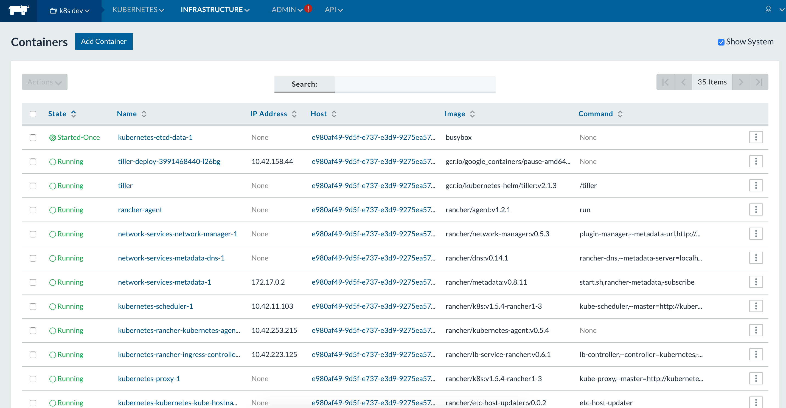
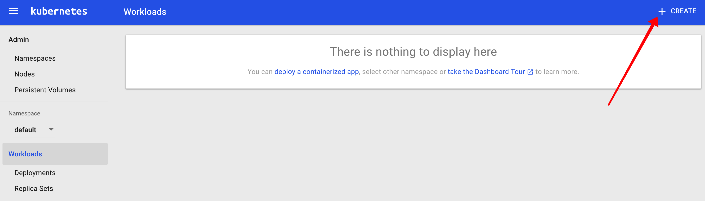
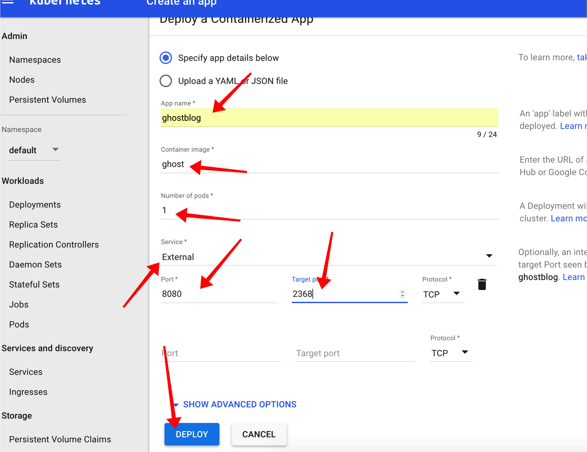
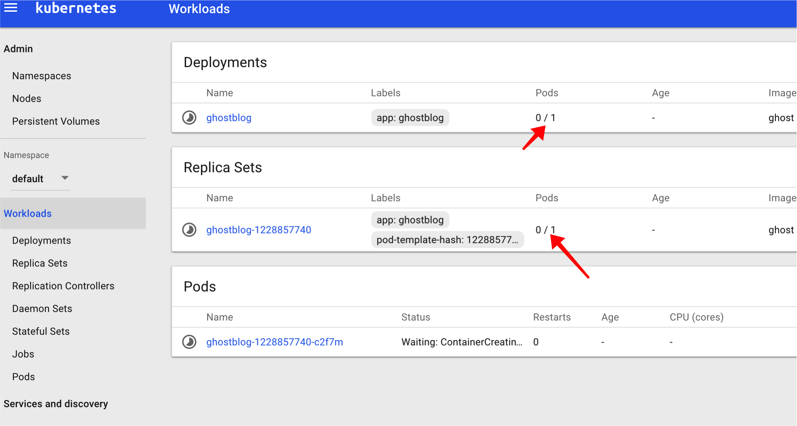
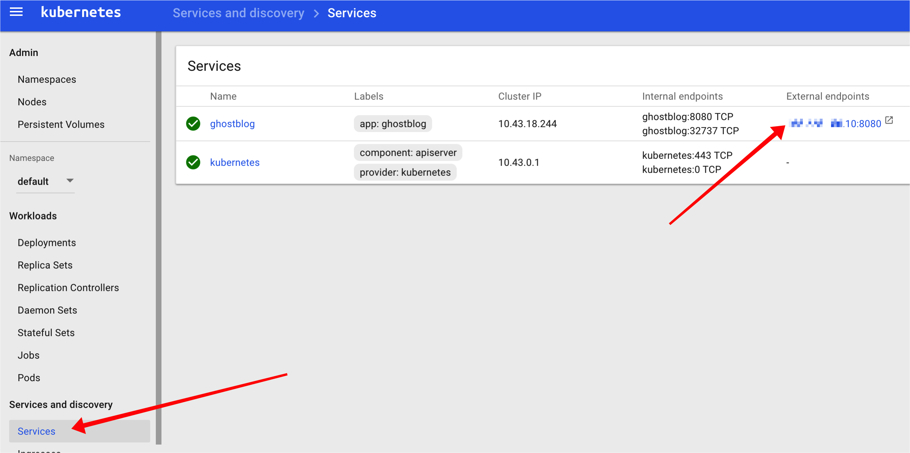
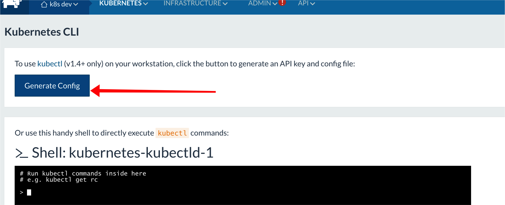
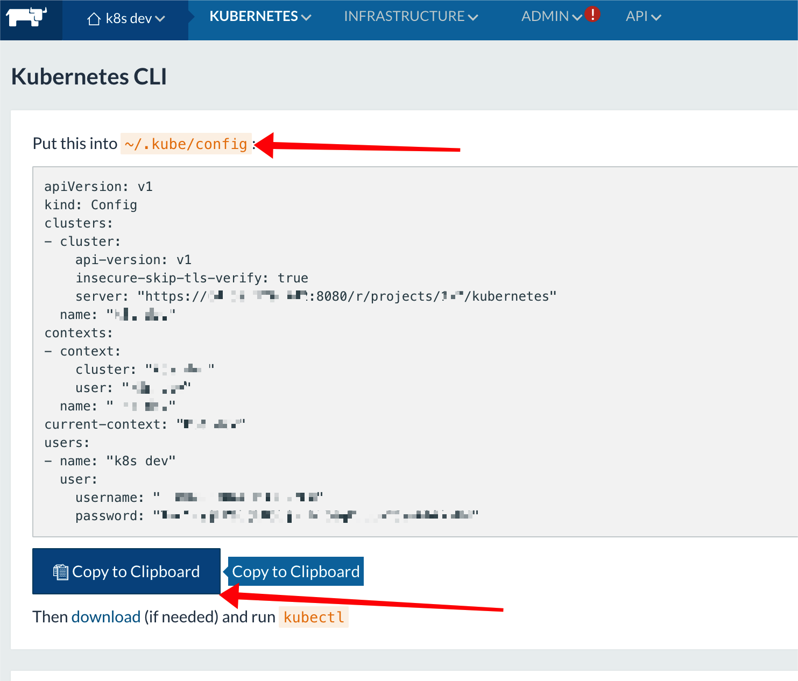
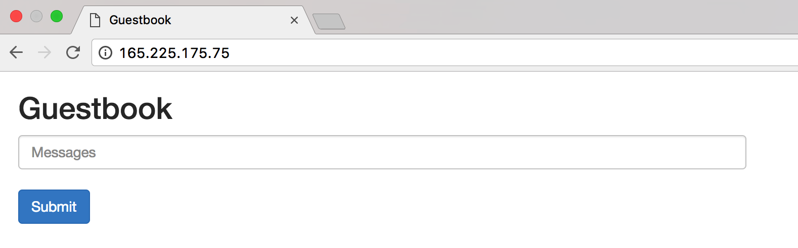
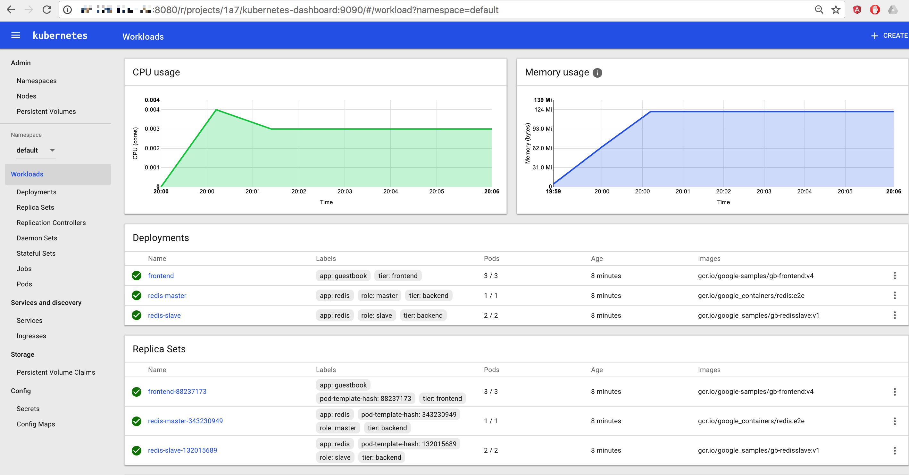

[Kubernetes](https://kubernetes.io/docs/concepts/overview/what-is-kubernetes/) is an open-source system for automating deployment, scaling, and management of application containers across clusters of hosts. Here I introduce the [Triton K8s Supervisor](https://github.com/fayazg/tritonK8ssupervisor) and walk through the steps required to run Kubernetes on Triton.

#### Step one: creating your Kubernetes Cluster.  

All it takes is the entry of a few simple parameters and then the Triton K8s Supervisor will automate the provisioning of the Triton virtual machine hosts, Docker Engines and networks that will serve as your Kubernetes Cluster.  The Triton K8s Supervisor leverages [Terraform](https://www.terraform.io/) and [Ansible](https://www.ansible.com/) to complete these steps, so you can easily modify your Kubernetes Cluster creation set up if you wish.

#### Step two: creating your Kubernetes Environment.

Once the Kubernetes Cluster is set up, the Triton K8s Supervisor will simply continue on and automate the provisioning of a Kubernetes Environment on the Kubernetes Cluster it just created.  The Triton K8s Supervisor leverages [Rancher](http://rancher.com/kubernetes) best practices and tools to complete this step, ensuring that you have a production grade, supportable (and easily upgradable) Kubernetes Environment.


#### Step three: deploying your first Kubernetes Managed Application.

As a final step, we will walk through deploying an application on your Kubernetes Environment using both the Kubernetes CLI and [Kubernetes Dashboard](https://kubernetes.io/docs/user-guide/ui/).

Follow along as through these three easy steps in detail below.  Complete them on your own, leveraging Triton’s [free trial](https://sso.joyent.com/signup) offer to get started, and in less than an hour you will have your very own, 100% open source, production-grade, Kubernetes stack.

### Let’s get started: the pre-requisites

In order to start running Triton K8s Supervisor, you must create a **Triton** account and install the **Triton CLI**, **Terraform**, **Ansible**, and the **Kubernetes CLI**.

[Triton](https://www.joyent.com/why) is our container-native and open source cloud, which we will use to provide the infrastructure required for your Kubernetes cluster. 

[Terraform](https://www.terraform.io/) enables you to safely and predictably create, change, and improve production infrastructure. It is an open source tool that codifies APIs into declarative configuration files that can be shared amongst team members, treated as code, edited, reviewed, and versioned. We use Terraform to provision virtual machines, set up root access, and install `python`.

[Ansible](http://docs.ansible.com/ansible/intro_installation.html) is an IT automation tool that enables app deployment, configuration management and orchestration. We are using Ansible to install pre-reqs (including supported version of docker-engine), create Kubernetes environment and set up Kubernetes cluster.

#### Install Triton

In order to install Triton, first you must have a [Triton account](https://sso.joyent.com/signup). As a new user you will recieve a $250 credit to enable you to give Triton and Kubernetes a test run, but it's important to [add your billing information](https://my.joyent.com/main/#!/account/payment) and [add an ssh key](https://my.joyent.com/main/#!/account) to your account. If you need instructions for how to generate and SSH key, [read our documentation](https://docs.joyent.com/public-cloud/getting-started).

1.  Install [Node.js](https://nodejs.org/en/download/) and run `npm install -g triton` to install Triton CLI.
1.  `triton` uses profiles to store access information. You'll need to set up profiles for relevant data centers.
    +   `triton profile create` will give a [step-by-step walkthrough](https://docs.joyent.com/public-cloud/api-access/cloudapi) of how to create a profile.
	+   Choose a profile to use for your Kubernetes Cluster.
1.  Get into the Triton environment with `eval $(triton env <profile name>)`.
1.  Run `triton info` to test your configuration.

#### Install Terraform

At this time, Triton only supports certain versions of Terraform. [Download supported version 4.15](https://releases.hashicorp.com/terraform/0.8.5/terraform_0.8.5_darwin_amd64.zip) and proceed to install.

Test your installation by running `terraform`. You should see an output similar to:

```
$ terraform
Usage: terraform [--version] [--help] <command> [args]

The available commands for execution are listed below.
The most common, useful commands are shown first, followed by
less common or more advanced commands. If you're just getting
started with Terraform, stick with the common commands. For the
other commands, please read the help and docs before usage.

Common commands:
    apply              Builds or changes infrastructure
    console            Interactive console for Terraform interpolations

# ...
```

#### Install Ansible

There are [many ways to install Ansible](http://docs.ansible.com/ansible/intro_installation.html), but the simplest would be to use Python package manager (`pip`). If you don’t already have `pip` installed, install it:

```
sudo easy_install pip
```
Ansible by default manages machines over SSH and requires Python 2.6 or 2.7 to be installed on all the hosts.

Install Ansible:

```
sudo pip install ansible
```

Once done, you can run `ansible` to test your installation. You should see a list of usage commands that looks like the following:

```
$ ansible
Usage: ansible <host-pattern> [options]

Options:
  -a MODULE_ARGS, --args=MODULE_ARGS
                        module arguments
  --ask-vault-pass      ask for vault password
  -B SECONDS, --background=SECONDS
                        run asynchronously, failing after X seconds
                        (default=N/A)
  -C, --check           don't make any changes; instead, try to predict some
                        of the changes that may occur
  -D, --diff            when changing (small) files and templates, show the
                        differences in those files; works great with --check
[...]
```

#### Install the Kubernetes CLI

There are different ways to [install `kubectl`](https://kubernetes.io/docs/tasks/kubectl/install/), but the simplest way is via `curl`:

```sh
# OS X
curl -LO https://storage.googleapis.com/kubernetes-release/release/$(curl -s https://storage.googleapis.com/kubernetes-release/release/stable.txt)/bin/darwin/amd64/kubectl

# Linux
curl -LO https://storage.googleapis.com/kubernetes-release/release/$(curl -s https://storage.googleapis.com/kubernetes-release/release/stable.txt)/bin/linux/amd64/kubectl

# Windows
curl -LO https://storage.googleapis.com/kubernetes-release/release/$(curl -s https://storage.googleapis.com/kubernetes-release/release/stable.txt)/bin/windows/amd64/kubectl.exe
```

### Now let's create a Kubernetes Cluster

The Triton K8s Supervisor uses `triton`, `terraform`, and `ansible` to set up and interact with a Kubernetes Cluster. Once those have been installed, you can download the [Triton K8s Supervisor package](https://github.com/fayazg/tritonK8ssupervisor.git), start `setup.sh`, and answer the prompted questions.

Default values will be shown in parentheses and if no input is provided, defaults will be used.

```
$ git clone https://github.com/fayazg/tritonK8ssupervisor.git
Cloning into 'tritonK8ssupervisor'...
$ cd tritonK8ssupervisor 
$ ./setup.sh
Name your Kubernetes environment: (k8s dev)
```

Provide a name for the Kubernetes Environment and press Enter.

```
Describe this Kubernetes environment: (k8s dev)
```

Provide a description for the Kubernetes Environment and press Enter.

```
Hostname of the master: (kubemaster)
```

Provide a hostname for the virtual machine that will run the Rancher Server container. This VM will be used to interact with Rancher and Kubernetes environments. Hostname must start with a letter and must be alphanumeric.

```
Enter a string to use for appending to hostnames of all the nodes: (kubenode)
```

Provide a prefix which will be used for all of the virtual machines that will be connected as nodes within your Kubernetes Cluster. This must be alphanumeric.

```
How many nodes should this Kubernetes cluster have: (1)
```

Provide the number of nodes that should be created/connected to your Kubernetes Cluster. The default provisioning limit on your free trial is set to 2 virtual machines (master + 1 node). If you need a larger size cluster, please contact <mailto:support@joyent.com> to request more resources.

```
From the networks below:
1.	Joyent-SDC-Private  909c0c0d-1455-404f-85bd-04f48b7b0059
2.	Joyent-SDC-Public  31428241-4878-47d6-9fba-9a8436b596a4
3.	My-Fabric-Network  0882d255-ac1e-41b2-b1d5-e08200ebb380
4.	kubernetes  0b206464-d655-4723-a848-86d0f28764c8
What networks should the master be a part of, provide comma separated values: (31428241-4878-47d6-9fba-9a8436b596a4)
```

Triton CLI is used here to pull all the active networks for the current data center defined in the Triton profile. Provide a comma-separated list of networks that the master virtual machine should be a part of (e.g. “2,4”).

```
From the networks below:
1.	Joyent-SDC-Private  909c0c0d-1455-404f-85bd-04f48b7b0059
2.	Joyent-SDC-Public  31428241-4878-47d6-9fba-9a8436b596a4
3.	My-Fabric-Network  0882d255-ac1e-41b2-b1d5-e08200ebb380
4.	kubernetes  0b206464-d655-4723-a848-86d0f28764c8
What networks should the nodes be a part of, provide comma separated values: (31428241-4878-47d6-9fba-9a8436b596a4)
```

Provide a comma-separated list of networks that the virtual machines used as Kubernetes nodes should be a part of (e.g. “2,4”). The nodes must be able to communicate to the master virtual machine or the setup will fail.

```
From the packages below:
1.	k4-bigdisk-kvm-15.75G  7741b8f6-2733-11e6-bdb9-bf11c4147d38
2.	k4-bigdisk-kvm-31.75G  14c01a1a-d0f8-11e5-ad69-1fd27456ad73
3.	k4-bigdisk-kvm-63.75G  14c0992c-d0f8-11e5-bd78-e71dad0f8626
4.	k4-fastdisk-kvm-31.75G  14bd9600-d0f8-11e5-a69c-97be6e961834
5.	k4-fastdisk-kvm-63.75G  14be13c8-d0f8-11e5-b55b-47eb44d4e064
6.	k4-general-kvm-15.75G  14ac8f5e-d0f8-11e5-a0e5-9b622a20595f
7.	k4-general-kvm-3.75G  14aba044-d0f8-11e5-8c88-eb339a5da5d0
8.	k4-general-kvm-31.75G  14ad1a32-d0f8-11e5-a465-8f264489308b
9.	k4-general-kvm-7.75G  14ac17a4-d0f8-11e5-a400-e39503e18b19
10.	k4-highcpu-kvm-1.75G  14b5edc4-d0f8-11e5-b4d2-b3e6e8c05f9d
11.	k4-highcpu-kvm-15.75G  14b783d2-d0f8-11e5-8d93-6ba10192d750
12.	k4-highcpu-kvm-250M  14b4ff36-d0f8-11e5-a8b1-e343c129d7f0
13.	k4-highcpu-kvm-3.75G  14b67ef6-d0f8-11e5-ba19-479de37c6f75
14.	k4-highcpu-kvm-7.75G  14b6fade-d0f8-11e5-85c5-4ff7918ab5c1
15.	k4-highcpu-kvm-750M  14b5760a-d0f8-11e5-9cb1-23c9c232c00e
16.	k4-highram-kvm-15.75G  14ba876c-d0f8-11e5-8a1b-ab02fdd17b07
17.	k4-highram-kvm-31.75G  14bafb20-d0f8-11e5-a5cf-e386b841ed87
18.	k4-highram-kvm-63.75G  14bb84f0-d0f8-11e5-8014-2fb7b19ccb24
What KVM package should the master and nodes run on: (14b6fade-d0f8-11e5-85c5-4ff7918ab5c1)
```

Triton CLI is used here to pull all the available KVM packages (i.e. virtual machine images) for the current data center defined by your Triton environment. Provide the corresponding number (e.g. "10" for k4-highcpu-kvm-1.75G) to be used for all the nodes.

After the package detail has been provided, the CLI will verify all the entries before creating the cluster.

```
Verify that the following configuration is correct:

Name of kubernetes environment: k8s dev
Kubernetes environment description: k8s dev
Master hostname: kubemaster
All node hostnames will start with: kubenode
Kubernetes environment will have 1 nodes
Master server will be part of these networks: 31428241-4878-47d6-9fba-9a8436b596a4
Kubernetes nodes will be a part of these networks: 31428241-4878-47d6-9fba-9a8436b596a4
This package will be used for all the hosts: 14b6fade-d0f8-11e5-85c5-4ff7918ab5c1

Make sure the above information is correct before answering:
    to view list of networks call "triton networks -l"
    to view list of packages call "triton packages -l"
Make sure that the nodes and master are part of networks that can communicate with each other.
Is the above config correct (yes | no)? yes
```

Answer the verification question, press enter, and the setup will start.

The Triton K8s Supervisor will store the provided inputs, generate a Terraform configuration for the environment and start Terraform tasks to provision the required virtual machine hosts for your Kubernetes Cluster. After all Terraform tasks are finished, Ansible configuration files are generated and Ansible roles are started to install Docker, start Rancher, create the Kubernetes Environment and connect all nodes to the Kubernetes Environment.

A long message will be displayed with URLs to different services as they start to come up. Here is a breakdown of that message:

```
Congratulations, your Kubernetes cluster setup has been complete.

It will take a few minutes for all the Kubernetes process to start up before you can access Kubernetes Dashboard
––––> To check what processes/containers are coming up, go to http://<ip of master>:8080/env/<env id>/infra/containers
    once all these containers are up, you should be able to access Kubernetes by its dashboard or using CLI
```

This URL is a link to the view within Rancher that provides a list of the containers that make up your Kubernetes Environment.  It will take a few minutes for all of these Kubernetes containers to start up.  You can use this view to see their status.  Details regarding Rancher's rich set of features can be found in the Rancher [Documentation](http://docs.rancher.com/rancher/v1.5/en/).



One of the last containers that will come up is for Kubernetes Dashboard. 

```
Waiting on Kubernetes Dashboard to come up.
...................................................................
––––> Kubernetes Dashboard is at http://<ip of master>:8080/r/projects/<env id>/kubernetes-dashboard:9090/
––––> Kubernetes CLI config is at http://<ip of master>:8080/env/<env id>/kubernetes/kubectl

    CONGRATULATIONS, YOU HAVE CONFIGURED YOUR KUBERNETES ENVIRONMENT!
```

The last container to come up will be for the Kubernetes Dashboard. Once that container is up your Kubernets Environment is ready.  You will get the above two URLs. The first URL is for the Kubernetes Dashboard, and the second URL is for Kubernetes CLI (`kubectl` config).  These will alow you to bypass Rancher and interact with the native Kubernetes interfaces.

Congratulations!  You have a production grade Kubernetes Environment ready for your use.  One note, however, before we move on to deploying some sample applications on your new, 100% open source, Kubernetes Environment.  If you want to customize any of these set up steps for your Kubernetes Environment, check out [this GitHub repo](https://github.com/fayazg/tritonK8ssupervisor/blob/master/docs/manual-setup.md) for an explanation of how to manually set up a Kubernetes Cluster on Triton.

### Now, let's deploy an app with Kubernetes

Now that your Kubernetes Environment is up and running, you can deploy apps using either the Kubernetes Dashboard or `kubectl`.

In this section we will walk through the deployment of a Ghost blog using the Kubernetes Dashboard and the example Kubernetes Guestbook app using the `kubectl`.

#### Deploy an app using the Kubernetes Dashboard (Web UI)

The [Kubernetes Dashboard](https://kubernetes.io/docs/user-guide/ui/) can be used to get an overview of applications running on your cluster, as well as to create or modify individual Kubernetes resources. The Kubernetes Dashboard also provides information on the state of Kubernetes resources in your cluster.


Now, let's deploy Ghost using the Kubernetes Dashboard.

First, get the URL for the Kubernetes Dashboard that the Triton K8s Supervisor provided at the end of the initial setup, and enter the URL in your browser to access your Kubernetes Dashboard.  Once you are in the Kubernetes Dashboard you should see a **CREATE** button at the top. Click the **CREATE** button to begin the process of deploying an app on your Kubernetes Environment.



Next, enter the details requested, using the inputs provided in the below image, and then click **Deploy**.



That's it!  Kubernetes should now be starting up your Ghost app and you should see something that looks like this:



Your app is configured to be exposed externally on port 8080. So, you should see the app URL under the services screen. Once the deployment is complete and pods are up, the app should be available.



#### Deploy an app using the Kubernetes CLI

Now, let's deploy the example Kubernetes Guestbook app using the Kubernetes CLI.

First, get the URL to the Kubernetes CLI config page, which will generate a `kubectl` config file, that the Triton K8s Supervisor provided at the end of the intial setup.

Go to the Kubernetes CLI config URL and click on **Generate Config**:



From the next screen click **Copy to Clipboard** and paste the content to the `~/.kube/config` file:




Now you should be able to use the `kubectl` command to deploy your app.

The app we will deploy is called [Guestbook](https://github.com/kubernetes/kubernetes/tree/master/examples/guestbook). Clone the repository to your local machine, and navigate to the app's directory in your terminal. We'll make one minor change to the configuration file so that we can interact with it using a public IP address for this demo:

```
git clone https://github.com/kubernetes/kubernetes.git
cd kubernetes/examples/guestbook
vi all-in-one/guestbook-all-in-one.yaml
```

In that configuration file (`all-in-one/guestbook-all-in-one.yaml`), uncomment the frontend service type, [`# type: LoadBalancer`](https://github.com/kubernetes/kubernetes/blob/master/examples/guestbook/all-in-one/guestbook-all-in-one.yaml#L130), so that it runs as a load balancer:

```
spec:
  # if your cluster supports it, uncomment the following to automatically create
  # an external load-balanced IP for the frontend service.
  type: LoadBalancer
  ports:
    # the port that this service should serve on
  - port: 80
  selector:
    app: guestbook
    tier: frontend
```

Be sure to save the file.

Now you should be able to use `kubectl` to deploy the app and get the external URL for the frontend service which can be used to access the app once the pods are up:

```
# Deploy guestbook app
 $ kubectl create -f all-in-one/guestbook-all-in-one.yaml
service "redis-master" created
deployment "redis-master" created
service "redis-slave" created
deployment "redis-slave" created
service "frontend" created
deployment "frontend" created

# Make sure that the pods are up and running
 $ kubectl get deployments
NAME           DESIRED   CURRENT   UP-TO-DATE   AVAILABLE   AGE
frontend       3         3         3            3           2m
redis-master   1         1         1            1           2m
redis-slave    2         2         2            2           2m

 $ kubectl get pods
NAME                           READY     STATUS    RESTARTS   AGE
frontend-88237173-b23b9        1/1       Running   0          2m
frontend-88237173-cq5jz        1/1       Running   0          2m
frontend-88237173-sbkrb        1/1       Running   0          2m
redis-master-343230949-3ll61   1/1       Running   0          2m
redis-slave-132015689-p54lv    1/1       Running   0          2m
redis-slave-132015689-t6z7z    1/1       Running   0          2m

# Get the external service IP/URL
 $ kubectl get services
NAME           CLUSTER-IP      EXTERNAL-IP      PORT(S)        AGE
frontend       10.43.80.176    165.225.175.75   80:30896/TCP   14s
kubernetes     10.43.0.1       <none>           443/TCP        7m
redis-master   10.43.0.176     <none>           6379/TCP       15s
redis-slave    10.43.141.195   <none>           6379/TCP       15s
```

We can see above, for this demo, all pods are running and the only service exposed externally is the frontend service on `165.225.175.75:80` which is the URL for guestbook app.



The deployment status for all the pods and services can also be viewed using the Kubernetes Dashboard. To check using Dashboard, go to the URL for the Web UI.



If you want to better understand what it takes to deploy Kubernetes on Triton, check out [Kubernetes on Triton – the hard way](https://www.joyent.com/blog/kubernetes-the-hard-way), by Joe Julian.  For more information on Kubernetes itself, dig into the [official Kubernetes user guide](https://kubernetes.io/docs/user-guide/) or the `kubectl` [cheatsheet](https://kubernetes.io/docs/user-guide/kubectl-cheatsheet/).  More information about Rancher can be found in the Rancher [Documentation](http://docs.rancher.com/rancher/v1.5/en/).

Put these three great technologies together and you end up with a 100% open source, supportable, and production grade Kubernetes stack, which you can easily run on the [Triton public cloud](https://www.joyent.com/why), or in your data center using [Triton software](https://www.joyent.com/why) as the foundation for your private cloud.
