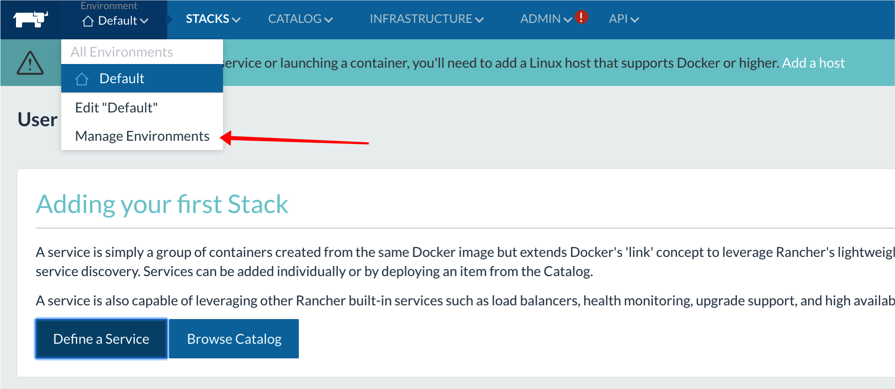
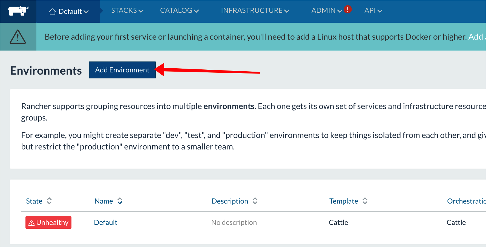
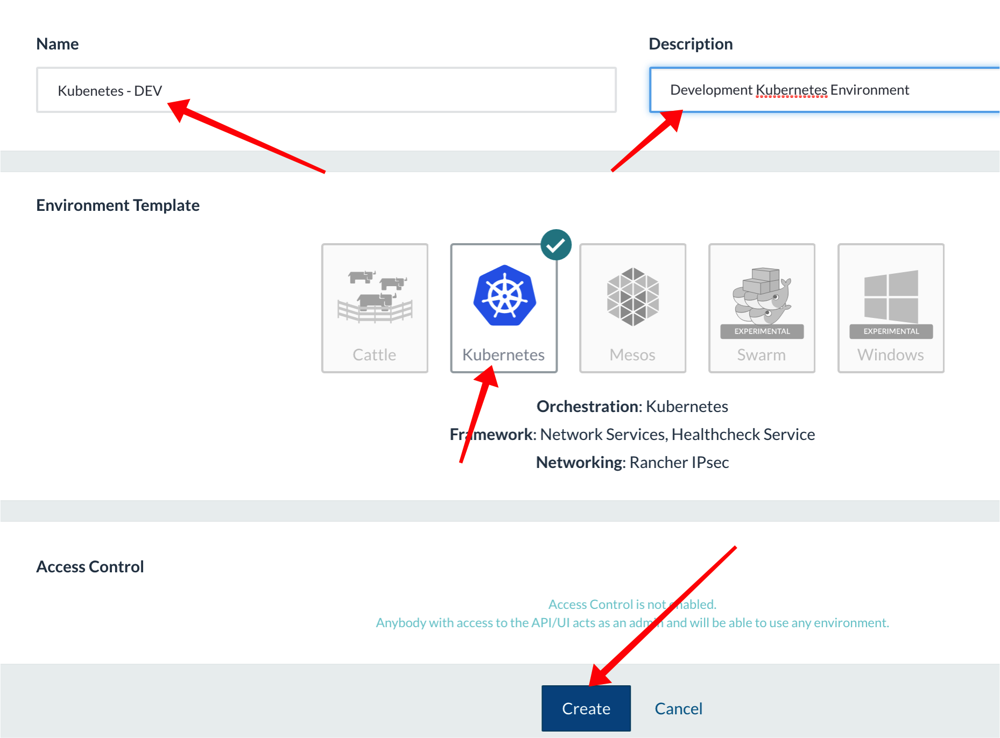
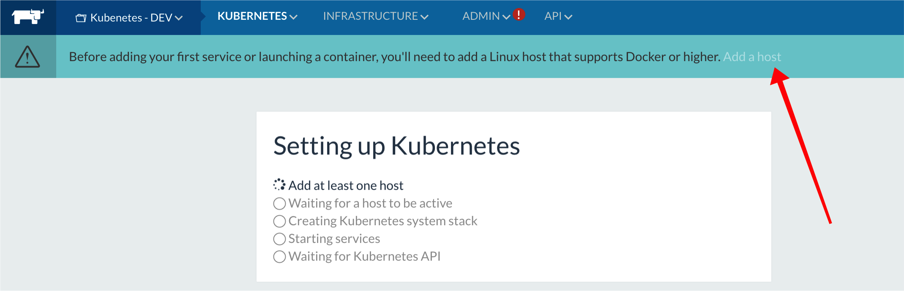
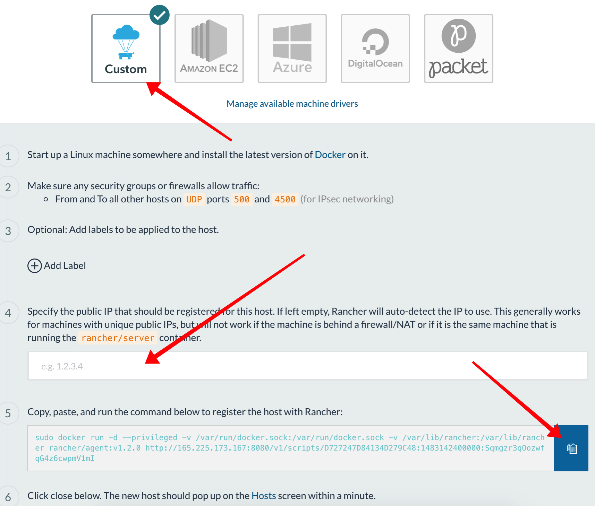
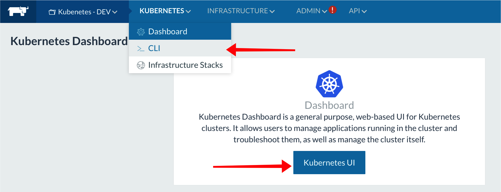

## Manual Setup
There are many ways to set up a Kubernetes Cluster. We are using Rancher as a kubernetes management platform. You can read more about Rancher and all it offers [here](http://rancher.com/rancher/).
Rancher runs as a docker container and runs/manages a production ready kubernetes cluster by running kubernetes services as containers. This section provides the steps needed to manually set up a Kubernetes cluster with three nodes on Rancher.

We will provision 4 kvms. One kvm will be used as Rancher server, and three will be used as worker nodes by kubernetes cluster. For a simple architecture diagram, click [here](#architecture).

### Provision KVMs
Provision one kvm for KubeServer
```bash
triton instance create --wait --name=kubeserver -N Joyent-SDC-Public \
    ubuntu-certified-16.04 k4-highcpu-kvm-1.75G
```
This will be the host where Rancher server container runs.

Provision three kvms for KubeNodes
```bash
triton instance create --wait --name=kubenode1 -N Joyent-SDC-Public \
    ubuntu-certified-16.04 k4-highcpu-kvm-1.75G
triton instance create --wait --name=kubenode2 -N Joyent-SDC-Public \
    ubuntu-certified-16.04 k4-highcpu-kvm-1.75G
triton instance create --wait --name=kubenode3 -N Joyent-SDC-Public \
    ubuntu-certified-16.04 k4-highcpu-kvm-1.75G
```
These are provisioned to be kubernetes worker nodes.

### Allow root access to all KVMs:
Triton’s default KVM setup allows for login only as ubuntu user with `sudo` access. We need to setup root access with our ssh key. Copy the `authorized_keys` file from ubuntu user to root for all hosts.
```bash
kubeserver=$(triton ip kubeserver)
kubenode1=$(triton ip kubenode1)
kubenode2=$(triton ip kubenode2)
kubenode3=$(triton ip kubenode3)

for h in $kubeserver $kubenode1 $kubenode2 $kubenode3; do
    ssh ubuntu@$h sudo cp /home/ubuntu/.ssh/authorized_keys /root/.ssh/
done
```
Make sure all your KVMs have been created and are running:
```bash
triton ls
SHORTID   NAME        IMG                              STATE    FLAGS  AGE
abde0e87  kubeserver  ubuntu-certified-16.04@20170221  running  K      5m
e3fe229a  kubenode1   ubuntu-certified-16.04@20170221  running  K      2m
baa582d0  kubenode2   ubuntu-certified-16.04@20170221  running  K      1m
2077abe8  kubenode3   ubuntu-certified-16.04@20170221  running  K      1m
```

### Install pre-reqs and docker-engine package on all KVMs:
Rancher and all kubernetes services run as docker containers managed by Rancher so configure and installed docker-engine version 1.12.6 on all KVMs.
```bash
for h in $kubeserver $kubenode1 $kubenode2 $kubenode3; do
ssh root@$h \
  'apt-get update && \
  apt-get upgrade -y && \
  apt-get install -y linux-image-extra-$(uname -r) && \
  apt-get install -y linux-image-extra-virtual zfs && \
  curl -fsSL https://apt.dockerproject.org/gpg |apt-key add - && \
  add-apt-repository "deb https://apt.dockerproject.org/repo/ ubuntu-$(lsb_release -cs) main" && \
  apt-get update && \
  apt-get -y install docker-engine=1.12.6-0~ubuntu-xenial'
done
```

### Start Rancher and setup Kubernetes environment and nodes
Start the rancher/server container on kubeserver KVM:
```bash
ssh root@$kubeserver docker run -d --restart=unless-stopped \
    -p 8080:8080 rancher/server
```

After the rancher/server docker container comes up, you should be able to access the Rancher UI and create a Kubernetes environment.

Go to the Rancher UI http\://$(triton ip kubeserver):8080 and select “Manage Environments” from the Environments tab:




Add a new environment:




Select Kubernetes from the list, provide a Name/Description and click create at the bottom of the page:




Now you should have a Kubernetes Environment which you can select from the “Environments” tab and add nodes to it by clicking “Add a host” button:




From here you will add all three nodes (kubenode1 kubenode2 and kubenode3) by performing the same steps:
1. Select Custom from the available machine drivers list
1. Enter the ip address of kubenode
1. Copy the docker command and run it on the kubenode




After the nodes have been added, kubernetes services will be started on each of the hosts and within minutes you will have your Kubernetes environment up and ready.

To deploy your app on your kubernetes environment, Rancher provides two simple options:
*   kubectl config which can be copied from “KUBERNETES -> CLI” tab
*   Kubernetes UI from “KUBERNETES -> Dashboard” tab


